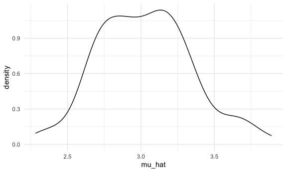
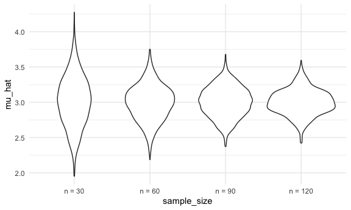
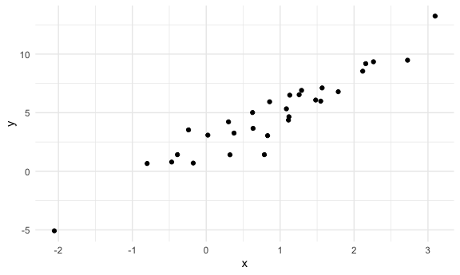
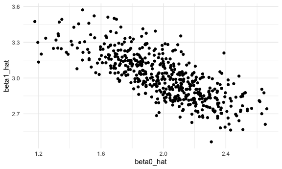
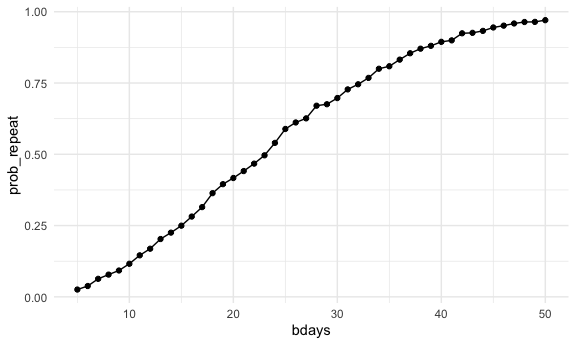

simulation
================
Kimia Faroughi
2025-10-30

Load key packages and source necessary files.

``` r
library(tidyverse)
```

    ## ── Attaching core tidyverse packages ──────────────────────── tidyverse 2.0.0 ──
    ## ✔ dplyr     1.1.4     ✔ readr     2.1.5
    ## ✔ forcats   1.0.0     ✔ stringr   1.5.1
    ## ✔ ggplot2   3.5.2     ✔ tibble    3.3.0
    ## ✔ lubridate 1.9.4     ✔ tidyr     1.3.1
    ## ✔ purrr     1.1.0     
    ## ── Conflicts ────────────────────────────────────────── tidyverse_conflicts() ──
    ## ✖ dplyr::filter() masks stats::filter()
    ## ✖ dplyr::lag()    masks stats::lag()
    ## ℹ Use the conflicted package (<http://conflicted.r-lib.org/>) to force all conflicts to become errors

``` r
source("source/sim_mean_sd.R")

#global ggplot settings
knitr::opts_chunk$set(
  fig.width = 6,
  fig.asp = .6,
  out.width = "90%"
)

theme_set(theme_minimal() + theme(legend.position = "bottom"))

options(
  ggplot2.continuous.colour = "viridis",
  ggplot2.continuous.fill = "viridis"
)

scale_colour_discrete = scale_colour_viridis_d
scale_fill_discrete = scale_fill_viridis_d
```

Can I “verify” the central limit theorem?

First with a `for` loop

``` r
output = vector("list", length = 100)

for (i in 1:100) {
  
  output[[i]] = sim_mean_sd(30)
  
}

output |> 
  bind_rows() |> 
  ggplot(aes(x = mu_hat)) +
  geom_density()
```



Try to repeat with a map statement.

``` r
sim_results_df =
  expand_grid(
    sample_size = c(30, 60, 90, 120),
    iter = 1:1000
  ) |> 
  mutate(
    results = map(sample_size, sim_mean_sd)
  ) |> 
  unnest(results)
```

Let’s look at this:

``` r
sim_results_df |> 
  mutate(
    sample_size = str_c("n = ", sample_size),
    sample_size = fct_inorder(sample_size)
  ) |> 
  ggplot(aes(x = sample_size, y = mu_hat)) +
  geom_violin()
```



Let’s try to summarize…

``` r
sim_results_df |> 
  group_by(sample_size) |> 
  summarize(
    emp_mean = mean(mu_hat),
    emp_se = sd(mu_hat)
  )
```

    ## # A tibble: 4 × 3
    ##   sample_size emp_mean emp_se
    ##         <dbl>    <dbl>  <dbl>
    ## 1          30     3.02  0.361
    ## 2          60     2.99  0.251
    ## 3          90     3.01  0.214
    ## 4         120     3.00  0.181

## Simple linear regression

``` r
sim_df =
  tibble(
    x = rnorm(30, mean = 1, sd = 1),
    y = 2 + 3*x + rnorm(30, 0, 1)
  )

sim_df |> 
  ggplot(aes(x = x, y = y)) +
  geom_point()
```



``` r
slr_fit = lm(y ~ x, data = sim_df)

coef(slr_fit)
```

    ## (Intercept)           x 
    ##    2.082352    3.060486

Turn this into a function

``` r
sim_regression = function(n_subj, beta_0 = 2, beta_1 = 3) {
  
  sim_df =
    tibble(
      x = rnorm(n_subj, mean = 1, sd = 1),
      y = beta_0 + beta_1*x + rnorm(n_subj, 0, 1)
    )

  sim_df |> 
    ggplot(aes(x = x, y = y)) +
    geom_point()
  
  slr_fit = lm(y ~ x, data = sim_df)
  
  tibble(
    beta0_hat = coef(slr_fit)[1],
    beta1_hat = coef(slr_fit)[2]
  )
  
}
```

``` r
sim_regression(n_subj = 30)
```

    ## # A tibble: 1 × 2
    ##   beta0_hat beta1_hat
    ##       <dbl>     <dbl>
    ## 1      2.14      2.73

``` r
output = vector("list", length = 500)

for(i in 1:500) {
  
  output[[i]] = sim_regression(n_subj = 30)
  
}

output |> 
  bind_rows()
```

    ## # A tibble: 500 × 2
    ##    beta0_hat beta1_hat
    ##        <dbl>     <dbl>
    ##  1      1.82      3.29
    ##  2      1.84      2.92
    ##  3      2.02      3.05
    ##  4      2.08      3.02
    ##  5      2.02      2.91
    ##  6      2.23      2.97
    ##  7      1.84      3.38
    ##  8      1.62      3.27
    ##  9      1.96      3.03
    ## 10      2.35      2.89
    ## # ℹ 490 more rows

``` r
slr_sim_results_df =
  expand_grid(
    sample_size = 30,
    iter = 1:500
  ) |> 
  mutate(
    results = map(sample_size, sim_regression)
  ) |> 
  unnest(results)

slr_sim_results_df |> 
  ggplot(aes(x = beta0_hat, y = beta1_hat)) +
  geom_point()
```



## One more example!

``` r
birthdays = sample(1:365, 5, replace = TRUE)

#if number of unique birthdays is < 5 (there is a repeated bday) this will return as true
repeated_bday = length(unique(birthdays)) < 5 

repeated_bday
```

    ## [1] FALSE

Put this in a function

``` r
bday_sim = function (n_room) {
  
  birthdays = sample(1:365, n_room, replace = TRUE)

  #if number of unique birthdays is < 5 (there is a repeated bday) this will return as true
  repeated_bday = length(unique(birthdays)) < n_room
  
  repeated_bday
  
}

bday_sim(20)
```

    ## [1] TRUE

``` r
bday_sim_results =
  expand_grid(
    bdays = 5:50, #number of people in the room
    iter = 1:2500
  ) |> 
  mutate(
    result = map_lgl(bdays, bday_sim)
  ) |> 
  group_by(
    bdays
  ) |> 
  summarize(
    prob_repeat = mean(result)
  )
```

Plot this

``` r
bday_sim_results |> 
  ggplot(aes(x = bdays, y = prob_repeat)) +
  geom_point() +
  geom_line()
```


